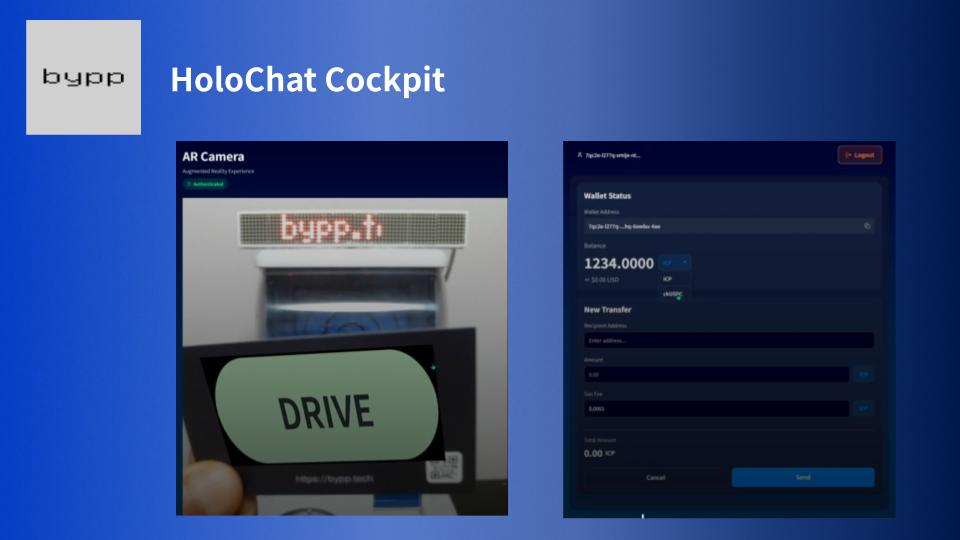

# Holo Chat Cockpit 
ICPプラットフォームを活用したIoTデバイスコントロールアプリです。  
ボタン操作、AR、自然言語チャットを用い直感的な操作でIoTデバイスを制御できます。  
また各種ICP制御機能を備え、現実世界のデバイスのRWA化を実現します。

[](https://www.youtube.com/watch?v=5zZ-vlNl94I)


## 機能

* ARによる直感的なデバイス操作
* AIを用いた自然言語チャットによるデバイス操作
* Internet Identityによるユーザー認証
* ICP,ckUSDCトークンでのデバイス操作権の管理

## 🚀 クイックスタート

### 前提条件
- Node.js 24.0.0以上
- dfx 0.28.0 以上
- mops 1.11.0 以上
- git

### インストール

1. **リポジトリクローン**
   ```bash
   git clone https://github.com/bypptech/holo-chat-cockpit
   cd holo-chat-cockpit
   ```

2. **依存関係インストール**
   ```bash
   npm install
   mops install
   ```

3. **ICPローカル環境セットアップ**
   ```bash
   cd icp-canister
   dfx start --clean --background
   dfx deploy
   cd ..
   ```
  
4. **環境変数設定**
   2.1 テンプレートから .env を作成します
   ```bash
   cp .env.template .env
   ```
   2.2 .env を編集します
   ```env
   EXPO_PUBLIC_ICP_MAINNET_CANISTER_ID_DRIVE_GACHA="canister-id-here"
   EXPO_PUBLIC_ICP_MAINNET_CANISTER_ID_DRIVE_GACHA_SECRET_TOKEN="secret-token-here"

   EXPO_PUBLIC_GEMINI_API_KEY="your-gemini-api-key-here"
   EXPO_PUBLIC_SUPABASE_URL="your-supabase-url-here"
   EXPO_PUBLIC_SUPABASE_ANON_KEY="your-supabase-anon-key-here"
   ```

5. **開発サーバー起動**
   ```bash
   npx expo start --web
   ```

6. **トークン発行**
   開発環境でテスト用トークンを発行する場合、以下のコマンドを実行します
   ```bash
   node test/mint.ts <receive address> <currency> <amount>
   ```
