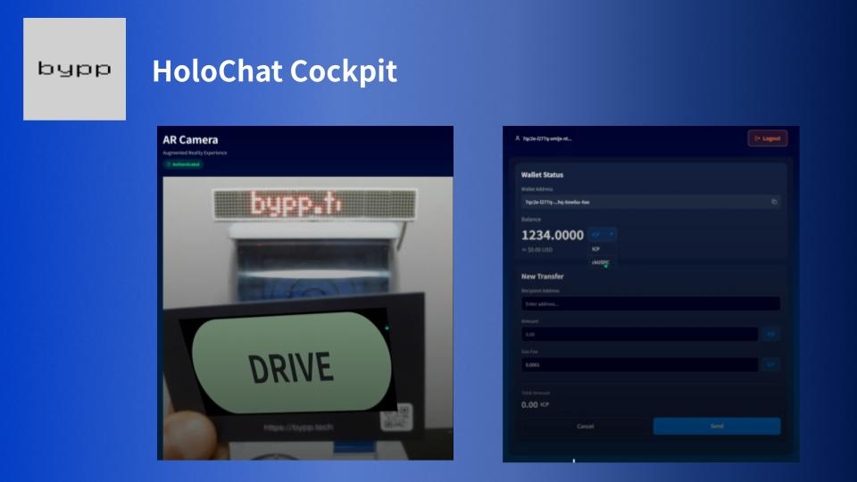

# Holo Chat Cockpit
An IoT device control app utilizing the ICP platform.  
You can intuitively control IoT devices using button operations, AR, and natural language chat.  
It is also equipped with various ICP control functions, enabling the RWA (Real World Asset) of physical devices.

[](https://www.youtube.com/watch?v=5zZ-vlNl94I)

## Features

* Intuitive device control via AR
* Device operation using AI-powered natural language chat
* User authentication with Internet Identity
* Management of device operation rights with ICP and ckUSDC tokens

## 🚀 Quick Start

### Prerequisites
- Node.js 24.0.0 or higher
- dfx 0.28.0 or higher
- mops 1.11.0 or higher
- git

### Installation

1. **Clone the repository**
   ```bash
   git clone https://github.com/bypptech/holo-chat-cockpit
   cd holo-chat-cockpit
   ```

2. **Install dependencies**
   ```bash
   npm install
   mops install
   ```

3. **Set up ICP local environment**
   ```bash
   cd icp-canister
   dfx start --clean --background
   dfx deploy
   cd ..
   ```
  
4. **Set environment variables**
   2.1 Create .env from the template
   ```bash
   cp .env.template .env
   ```
   2.2 Edit .env
   ```env
   EXPO_PUBLIC_ICP_MAINNET_CANISTER_ID_DRIVE_GACHA="canister-id-here"
   EXPO_PUBLIC_ICP_MAINNET_CANISTER_ID_DRIVE_GACHA_SECRET_TOKEN="secret-token-here"

   EXPO_PUBLIC_GEMINI_API_KEY="your-gemini-api-key-here"
   EXPO_PUBLIC_SUPABASE_URL="your-supabase-url-here"
   EXPO_PUBLIC_SUPABASE_ANON_KEY="your-supabase-anon-key-here"
   ```

5. **Start the development server**
   ```bash
   npx expo start --web
   ```

6. **Token minting**
   To mint test tokens in the development environment, run the following command:
   ```bash
   node test/mint.ts <receive address> <currency> <amount>
   ```
